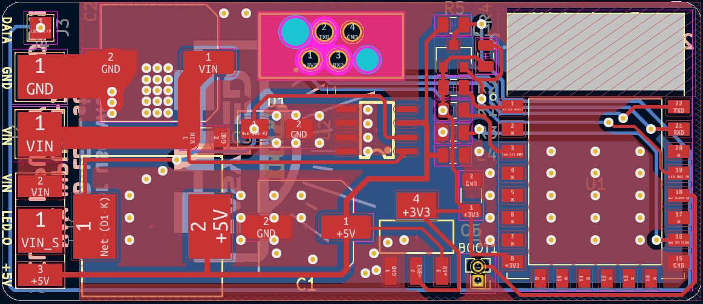
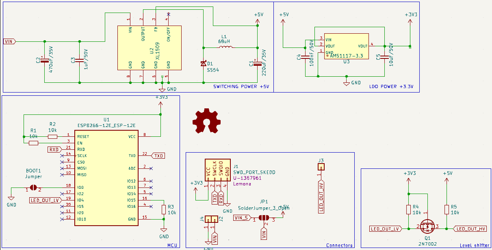

# Addressable RGB LED Controller PCB for WLED

This is a custom PCB designed for controlling addressable RGB LED lights using [WLED](https://github.com/Aircoookie/WLED). The board supports both 5V and 12V LEDs, making it versatile for various setups. It is compact, reliable, and optimized for seamless integration with WLED firmware.

## Features
- Compatible with WLED firmware.
- Supports addressable LEDs (e.g., WS2812, SK6812).
- Integrated voltage regulation for 5V and 12V operation.
- Compact layout with easy connections for power and data.

## Documentation

### PCB Layout

### Schematic

